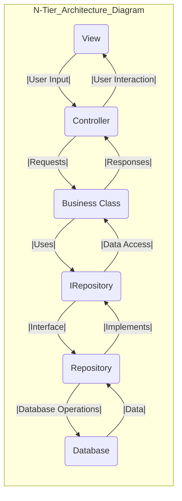
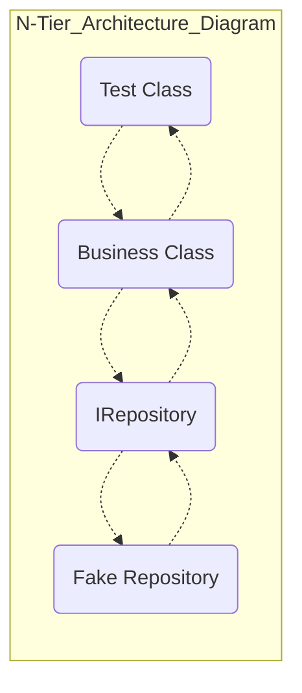

# Intro

> for the classic n-tier .net application architecture looks like this 

- Again, to overcome the problem of testing our business class. What we can do in here is that if we want to only test what's happening in our business class without having to really deal with a real database, what we can do is that we we can implement an interface.

- So we introduce an interface and our repository class will implement that interface and then the business class will only deal with the interface.

- So we kind of use a layer of abstraction to decouple our business class from our repository class. By doing so, we can isolate that business class and only focus on that and test that piece of code without having to write anything to database.

- because our business class only works with our repository and has no idea what is behind that repository, we can easily not use the real repository and just have a class that implements a repository, but it really does nothing. 

- That's why I call it empty or fake repository. So it has the same methods that the real repository has. But then those methods imagine that are empty and they don't do anything. And because they don't do anything, we don't deal with the real database. And therefore there is no hard dependency in here.

- For example, you can test your controller without having to deal with the real business class or with the repository. You can isolate any class, any part of your application with this technique and just write a unit test for it. That's why we call this unit test because you only test one unit or one piece of your application without having to deal with any other parts of the application.